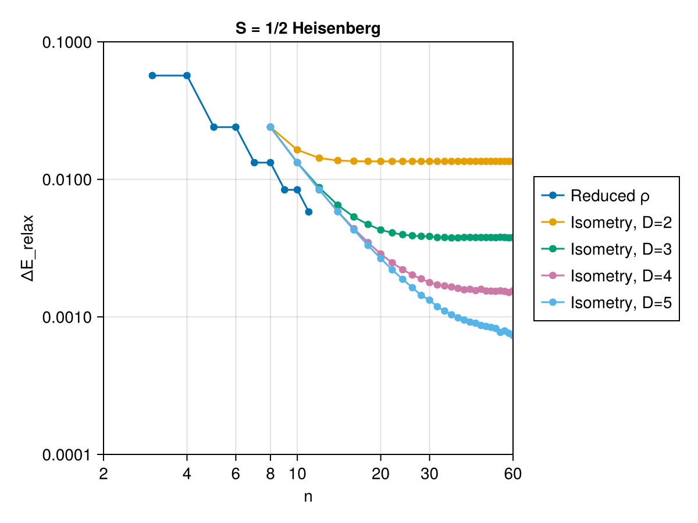
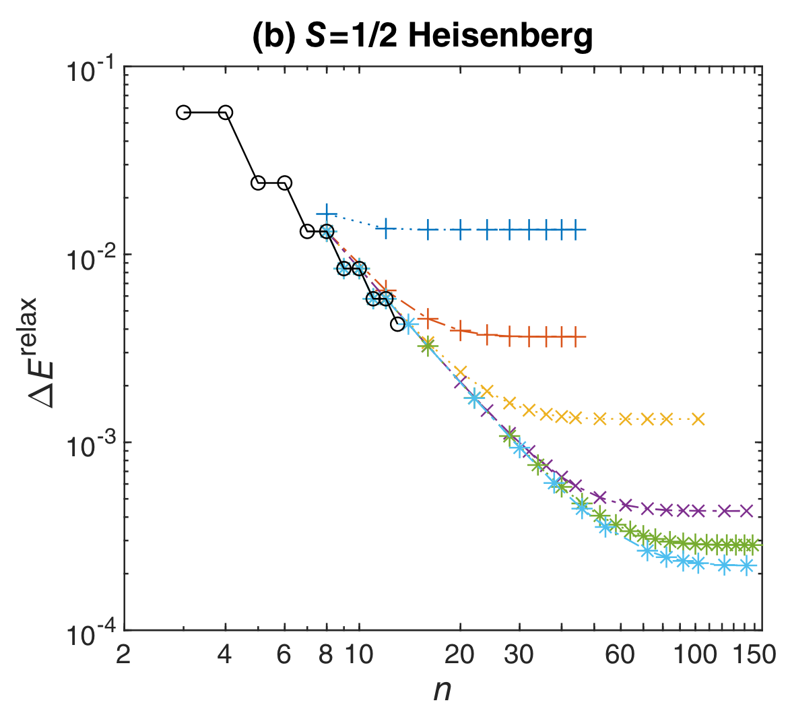

# Implementation

The implementation consist of two parts. The first part is the convex optimization formulation of the problem. The second part is the application of the isometry to reduce the number of constraints in the convex optimization problem. 

## Convex Optimization via Reduced Density Matrix

!!! tip "Choice of Convex Optimization Packages"
    There are two choices when it comes to convex optimization packages in Julia. The first is `Convex.jl` and the second is `JuMP.jl`. The choice of `JuMP.jl` is made because it avoids the cumbersome checking of convexity of our problem as indicated [here](https://discourse.julialang.org/t/help-speeding-up-problem-with-convex-jl/79005/22). Note that if you would like to have a more accurate result, you should use `Convex.jl` and it is more performant when your constraints come in matrix and vector form as it ensures type stability.

This step is carried out with function [`one_step_approx_dual`](@ref). Instead of solving the primal problem, we solve the [dual problem](https://en.wikipedia.org/wiki/Duality_(optimization)). The dual problem has fewer parameters ($d^{2(n-1)+1}$ vs $\sum_{i=3}^{n} d^{2i}$) hence is faster to solve. It is possible to automatically convert the primal problem with [Dualization.jl](https://github.com/jump-dev/Dualization.jl). However, it is time costly. We formulate the dual problem directly following Eqn [44] in [^1].

[^1]: [kull2024lower](@cite)

## Applying Isometry

This step requires us to apply the isometry and reduce dimension of the reduced density matrix. 

A good isometry is obtained from a variationally obtained ground state estimation of the Hamiltonian. We use the [MPSKit.jl](https://github.com/QuantumKitHub/MPSKit.jl) to obtain the ground state estimation. For convinence, we provide a function [`good_ground_state`](@ref) to obtain the ground state estimation. If you choose to use a pre-solved ground state estimation, you might need to trim down the virtual bond dimension of the MPS to desired value. This is achieved with [`approx_ground_state`](@ref).

After obtaining the ground state MPS, we use the left canonical form of the MPS to obtain the isometry. It is implemented in function [`CGmapping_from_AL`](@ref).

Finally, with the isometry, we can reduce the dimension of the reduced density matrix. For clarify sake's we only consider the primal problem. The implementation is done in function [`two_step_approx`](@ref).

## Results
As a result, we obtain the following plot for how close the lower bound was for
the ground state energy. We obtain the ground state energy for the Heisenberg
XXX model $H = \sum_{i}^{N} X_{i}X_{i+1} + Y_{i}Y_{i+1} + Z_{i}Z_{i+1}$. The
theoretical value for the ground state energy per site is $e_{0} = 1/4 -
\ln{2}$. Let the ground state energy per site obtained from convex optimization
with relaxed constrains be $e_{rlx}$, we define the gap of groun state energy as
$\Delta E_{relax} = e_{0} - e_{rlx}$

|    Replication Results   |     Paper Results        |
:-------------------------:|:-------------------------:
          |  

