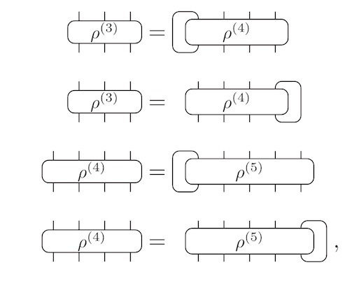
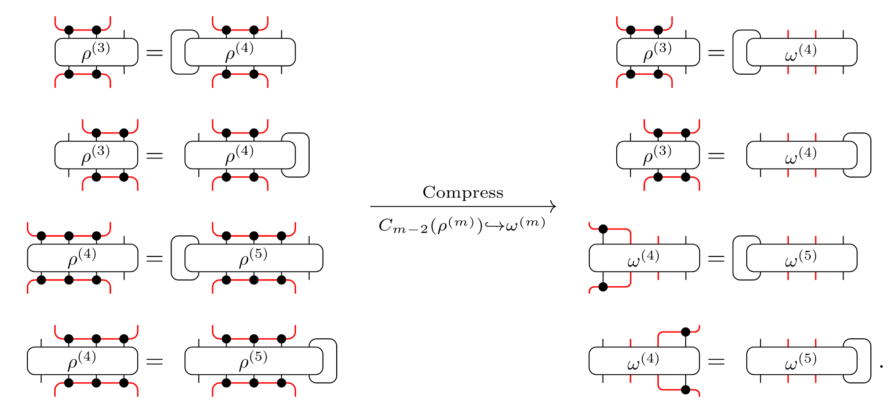

# Motivation
We want to find the ground state of a local Hamiltonian for a spin-system on
some lattice.

A spin-system is a collection spin each with Hilbert space $\mathbb{C}^d$. For
simplicity, we will consider spins residing on a chain with uniform distance
$a$.

The local Hamiltonian is denoted as $H = \sum_{i}^{N} h_i$ where $h_i$ only acts
non-trivially on a few spins that are physically close together. For simplicity,
we will consider a $2$-local Hamiltonian $H = \sum_{i}^{N} h_{i}^{(2)}$. More
concretely, we could think of the Hamiltonian having the form:

$$H = \sum_{i}^{N} X_{i}X_{i+1} + Y_{i}Y_{i+1} + Z_{i}Z_{i+1}$$

The ground state energy may diverge in case $N \rightarrow \infty$. Therefore,
we rephrase our goal into finding the ground state energy per-site for a
Hamiltonian.

$$e_{0} = \min_{\ket{\psi}} \frac{1}{N} \bra{\psi} H \ket{\psi}$$

Due to translational invariance of the Hamiltonian, we would expect the ground
state energy to also be reached with the following equation

$$e_{0} = \min_{\ket{\psi}} \bra{\psi} h_{i}^{(2)} \ket{\psi}$$

Since $h_{i}^{(2)}$ has no support on spins other than the two at location $i$
and $i+1$, we could safely simplify the minimization. Instread of trying to
minimize $e_{0}$ over an exponentially large state $\ket{\psi}$, similar result
is achieved when you do the minimization over reduced density matrix on spin $i$
and $i+1$, we denote it as $\rho^{(2)}$.

$$e_{0} = \min_{\rho^{(2)}} tr( \rho^{(2)} h_{i}^{(2)})$$

However, this naive reduction will bring problems because $\rho^{(2)}$ may not
correspond to a physical state. Therefore, we need to add the constraint that
$\rho^{(2)}$ be the reduced density matrix on two spins obtained from a reduced
density matrix on three spins. This constraint alone will make the solution more
physical. However, we would still improve by posting a series of constraint for
our 1D example:

$$\rho^{(i)} = tr_{L}(\rho^{(i+1)}) = tr_{R}(\rho^{(i+1)})$$

The right most equation is referred to as the Locally Translation Invariant
(LTI) conditions.

where $tr_{L/R}$ denotes the partial trace of the left/right most spin's Hilbert
space. Using a graphical tensor network representation, we could visualize the
constraints as follows:

[^1]

[^1]: [kull2024lower](@cite)

When the above constraints are taken into account up to $n$ spins'
reduced density matrix, we denote the all such two-spin reduce density matrix
$\rho^{(2)}$ with set $\mathcal{S}$.

A good news is that $\mathcal{S}$ is a convex set. Furthermore, the $e =
tr(\rho^{(2)} h_{i}^{(2)})$ is a linear function and the constrains are also
linear. Therefore, we could use convex optimization to find the ground state
energy per-site.

$\rho^{(2)}$ that gives the same $e = tr(\rho^{(2)} h_{i}^{(2)})$ forms a
hyperplane. Finding $e_0$ is equivalent to finding the hyperplane with lowest
energy. This is visualized in the following diagram

[^1]

When we add more constraints, this amounts to cutting $\mathcal{S}$. When we
follow the lines of previous reasoning and adds more restrictions in the form of

$$\rho^{(i)} = tr_{L}(\rho^{(i+1)}) = tr_{R}(\rho^{(i+1)})$$

we pay a price of adding exponentially more constraints since the dimension of
$\rho^{(i)}$ is $d^{2i}$. Another observation is that not all constraints are
essential to obtain the hyperplane with $e = e_{0}$. This promotes
simplification to the algorithm. Rather than strictly requiring all the
constraints be satisfied

$$\rho^{(i)} = tr_{L}(\rho^{(i+1)}) = tr_{R}(\rho^{(i+1)})$$

we could instead do isometries and pick out part of the reduced density matrix
that are closestly related to ground states. 

[^1]
