# Variational Uniform Matrix Product State

---

A **variational** algorithm for finding the **ground state** of a **translational invariant Hamiltonian**. 

## Key Ingredients of Variational Method 

1. translational invariant Hamiltonian: $H$  
2. Matrix Product State (MPS) $\Psi(A)$ parameterized by tensor $A$
3. Methods to take gradient and update ansatz.  
    { width=90% }

--- 

### How to update

- Gradient g: 
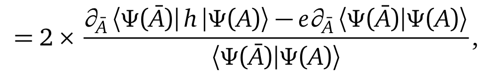
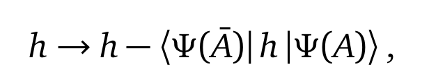
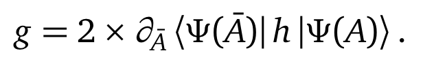
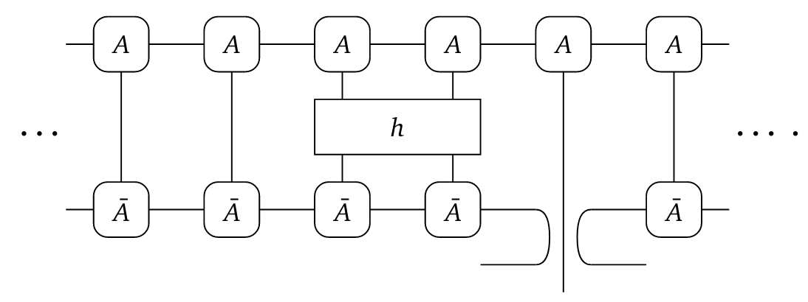
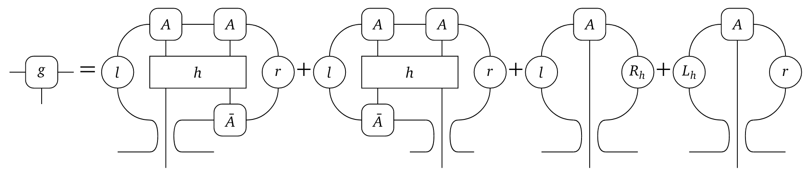
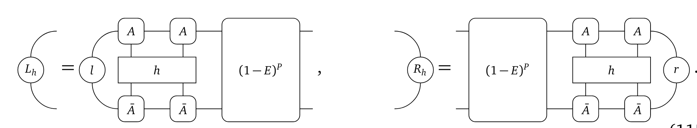
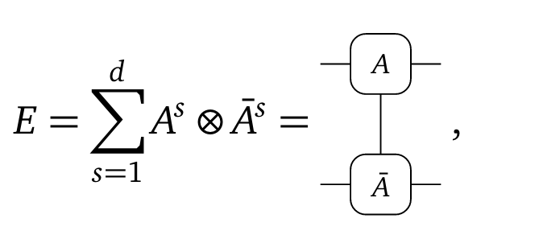

$A' = A .- g$

- 

### Hello

- Changes that keeps MPS on the manifold representable by $| \Psi(A) \rangle$
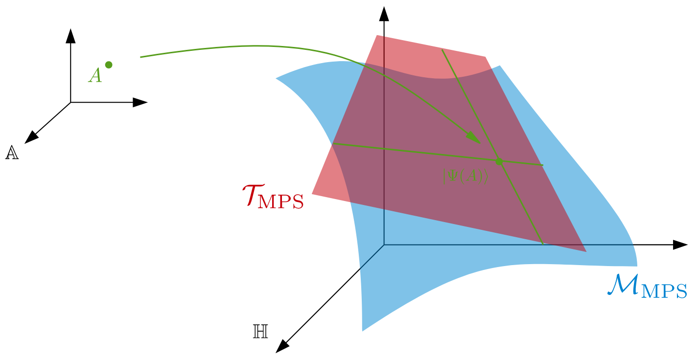{ width=70%}
- Tangent vector: $| \Phi(B;A) \rangle := B^i \frac{\partial}{\partial A_{i}} | \Psi(A) \rangle := B^i |\partial_{i}\Psi(A)\rangle$
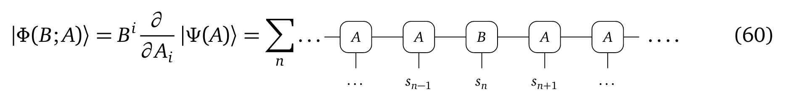

#### Choice of B
- Gauge freedom of $A$ gives gauge freedom of $B$
- There are some gauge that makes computation of $\langle \Phi(B;A) | \Psi(B;A) \rangle$ easier
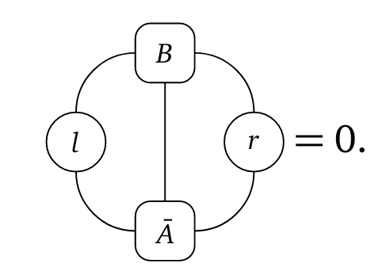
- E.g for easiness
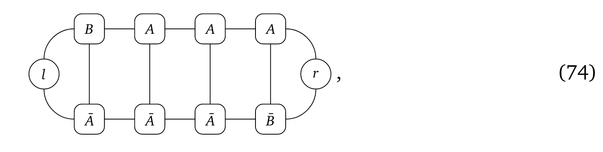
- Construction of B
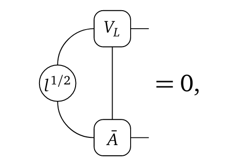
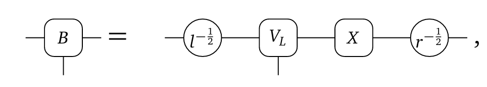
---