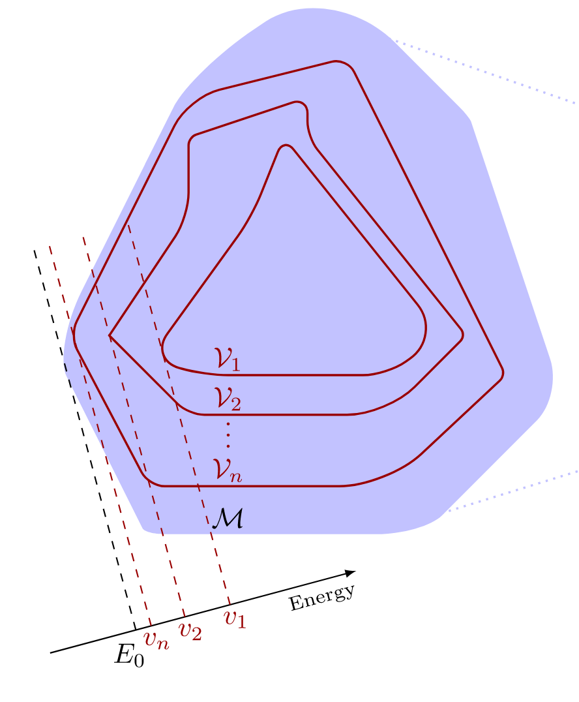
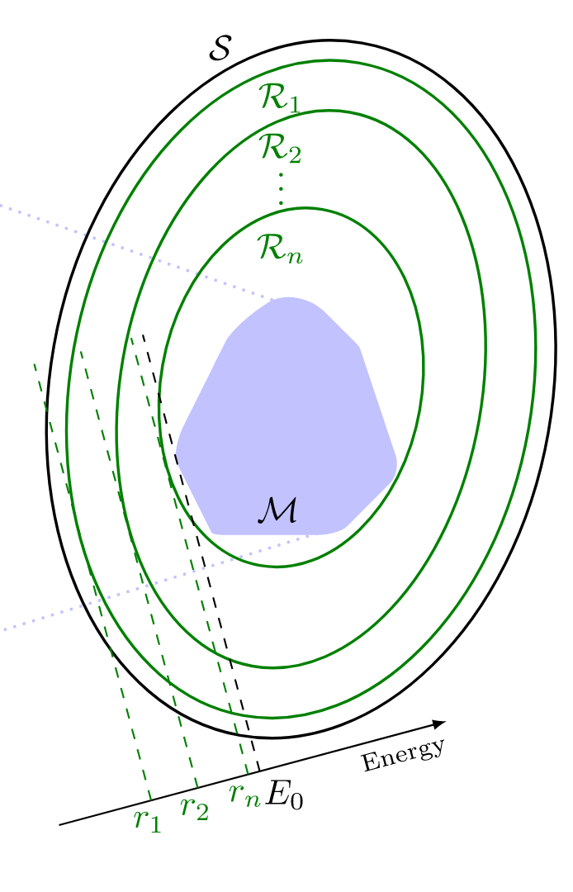
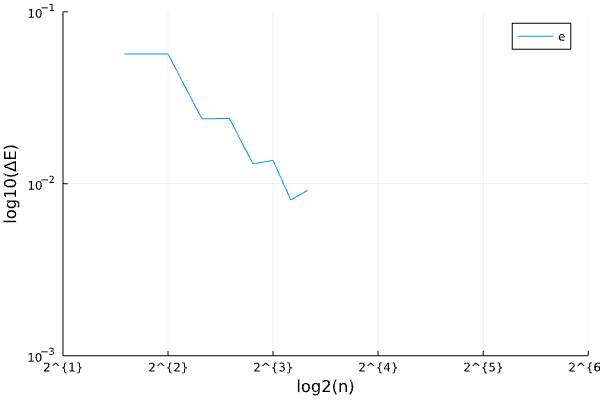
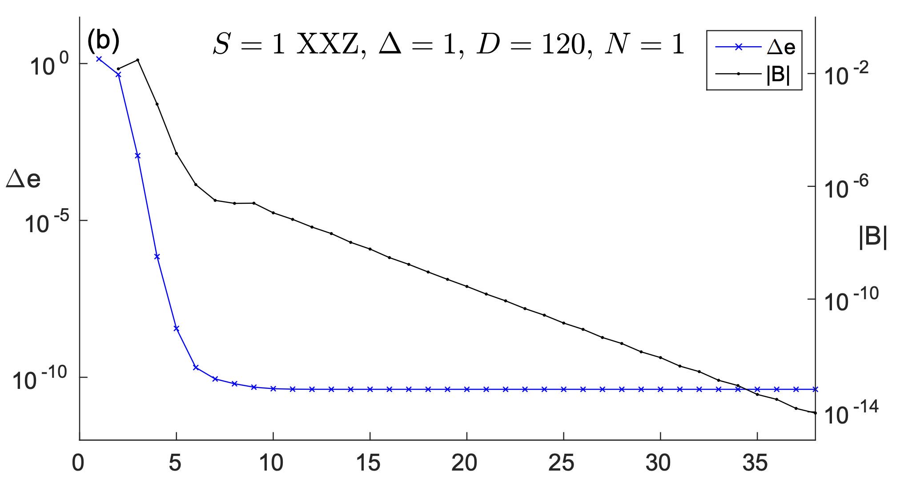
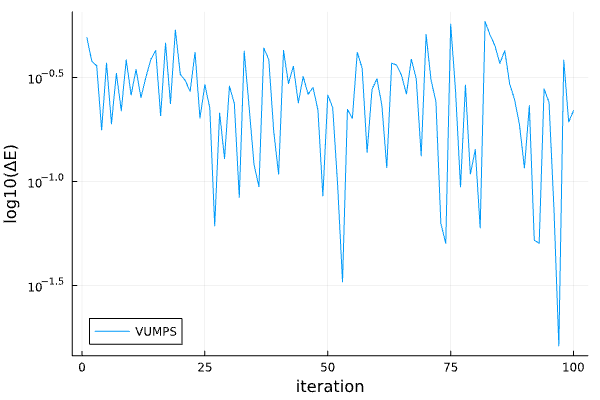

# Lower Bounds on Ground-State Energies of Local Hamiltonians

---

## Problem Setup 
- Local Hamiltonian: $H = \sum_{loc}h_{loc}$
- E.g: 
    1. $<i,j>$ are nearest neighbor indices on Infinite 1D chain. 
    2. $H = \sum_{<i,j>} (X_iX_j + Y_iY_j + Z_iZ_j)/4$
- Goal: Find the ground state energy of $H$

---

## Variational Method 
- Anstaz: $\psi(\vec{\theta})$

{ width=50% }

---

## SDP Method
- $\rho^{(2)}$: two site reduced density matrix 
- Goal: Find $\rho^{(2)}$ that minimizes $Tr(h_{loc}\rho^{(2)})$
- Constraints: 
    1. $\rho^{(2)} \geq 0$, $Tr(\rho^{(2)}) = 1$
    2. $\rho^{k-1} = Tr_{L}(\rho^{k}) = Tr_{R}(\rho^{k})$, $k = 2,3,...,n$
    3. $\rho^{k} \geq 0$

---

### Pictorially
{ width=30% }

---

### Result and Analysis
- Code
- Exponential amount of constraints in $n$.
{ width=50% }

---

## Coarse Graining
- Not all constraints on $\rho^{(k)}$ are necessary
- Constraints related to ground states are important 

---

### How to obtain constraints?
- Obtain ground state of $H$ using variational method
- VUMPS algorithm are problematic 

---

### Problem with VUMPS

{ width=50% }

{ width=50% }
